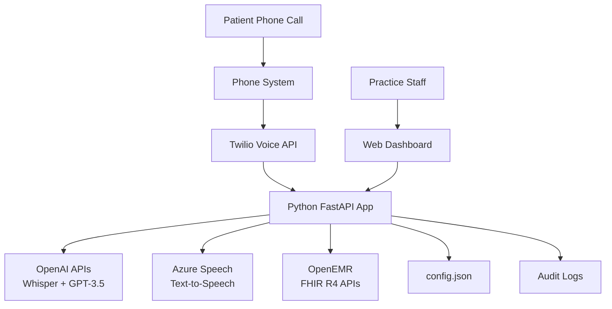

# Voice AI Platform Fullstack Architecture Document

**Version**: 1.0
**Date**: 2025-01-20
**Author**: Winston (Architect)
**Status**: MVP Architecture with Expansion Paths
**Scope**: Minimum Viable Product (6-8 week timeline)
**Expansion Ready**: Yes - Modular design supports Phase 2 features

## **Executive Summary**

This architecture document defines a **radically simplified voice AI appointment scheduling system** for healthcare practices, designed for **MVP delivery in 6-8 weeks** by a solo developer. The architecture prioritizes **deployability and maintainability** over technical sophistication, while providing **clear expansion paths** for future growth.

**Key Architectural Decisions:**
- **Simplified monolithic deployment** instead of distributed microservices
- **Direct EMR integration** without local data synchronization complexity
- **Cloud voice processing** accepting cost for maximum simplicity
- **Minimal web dashboard** without complex frontend frameworks
- **File-based configuration** avoiding database administration overhead
- **Modular component design** enabling future expansion without rewrites

## **MVP Scope Definition**

### **What's IN Scope for MVP**

**Core Voice AI Functionality:**
- Basic appointment scheduling via phone calls
- Patient identification through EMR lookup
- Provider availability checking
- Direct appointment creation in OpenEMR
- Simple appointment confirmations

**Minimal Admin Interface:**
- View today's AI-scheduled appointments
- Basic system status monitoring
- Simple on/off controls
- Error log visibility

**Essential Integrations:**
- OpenEMR OAuth 2.0 authentication
- FHIR R4 patient search
- Basic appointment creation
- Twilio phone system integration

**Compliance Minimums:**
- Basic HIPAA audit logging
- Encrypted credential storage
- Session-based admin authentication

### **What's OUT of Scope for MVP (Future Phases)**

**Deferred to Phase 2:**
- Insurance verification (FR12)
- Appointment type categorization with durations (FR13)
- Provider-specific scheduling preferences (FR14)
- Patient communication preferences (FR15)
- Waiting list management (FR16)
- Family member authorization (FR17)
- Appointment confirmations via SMS/email
- Appointment rescheduling/cancellation
- Multi-language support beyond English
- Advanced error recovery and retry logic
- Comprehensive reporting and analytics
- Multi-practice support
- Local AI model deployment

**Deferred to Phase 3:**
- Multiple EMR integrations
- Advanced voice biometrics
- Predictive scheduling
- Complex workflow automation
- Mobile applications
- Cloud deployment options

## **High Level Architecture**

### **Technical Summary**

The Voice AI Platform employs a **monolithic deployment architecture** with **modular internal components**, deployed as a single Windows executable for on-premise practice installation. The system integrates **FastAPI backend services** with a **vanilla JavaScript Bootstrap frontend**, connected to **OpenEMR via OAuth 2.0 and FHIR R4 APIs**.

Voice processing utilizes **cloud-based services**: speech-to-text (OpenAI Whisper), natural language processing (OpenAI GPT-3.5), and text-to-speech (Azure Speech Services), accepting higher operational costs for maximum simplicity and reliability.

### **Platform and Infrastructure Choice**

**Platform:** On-Premise Windows 10+ Deployment
**Key Services:** FastAPI web server, OpenAI/Azure APIs, OpenEMR OAuth client
**Deployment:** Practice local network, no cloud hosting required

### **Repository Structure**

```
voice-ai-platform/
├── src/
│   ├── main.py              # FastAPI application entry
│   ├── services/
│   │   ├── voice.py        # Voice processing service
│   │   ├── emr.py          # EMR integration service
│   │   ├── phone.py        # Phone system connector
│   │   ├── security.py     # Security and audit service
│   │   └── monitor.py      # System monitoring service
│   ├── config.py           # Configuration management
│   └── utils.py            # Helper functions
├── static/
│   ├── dashboard.html      # Admin dashboard
│   └── app.js              # Dashboard JavaScript
├── config.json             # Practice configuration
├── requirements.txt        # Python dependencies
├── install.bat            # Windows installer
└── README.md              # Setup documentation
```

### **High Level Architecture Diagram**



## **Technology Stack**

| Category | Technology | Version | Purpose | Rationale |
|----------|------------|---------|---------|-----------|
| Backend Language | Python | 3.9+ | Voice AI and EMR integration | Rich ecosystem for healthcare and AI |
| Backend Framework | FastAPI | 0.104.x | REST API and web serving | Automatic OpenAPI docs, async support |
| Frontend | Vanilla JavaScript | ES2022 | Simple dashboard | No build process complexity |
| UI Framework | Bootstrap | 5.3.x | Responsive UI components | Rapid development with proven patterns |
| Voice Processing | OpenAI APIs | Latest | Speech-to-text, NLP, TTS | Best accuracy for medical language |
| Phone Integration | Twilio Voice | Latest | Phone system connection | Universal compatibility |
| Authentication | OAuth 2.0 | Standard | EMR integration | Healthcare industry standard |
| Storage | File System | OS Native | Configuration and logs | Zero administration overhead |

## **Simplified API Specification**

### **Core Endpoints (5 Total for MVP)**

```yaml
# Voice Processing
POST /api/v1/voice/call
  Description: Process incoming voice call
  Auth: API Key
  Body: { audio_url, phone_number }
  Response: { status, appointment_id, confirmation_audio }

# Dashboard Data
GET /api/v1/appointments/today
  Description: Get today's AI appointments
  Auth: Session
  Response: { appointments: [...] }

# System Health
GET /api/v1/status
  Description: System health check
  Auth: None
  Response: { status, emr_connected, voice_ai_connected }

# Admin Interface
GET /dashboard
  Description: Serve admin dashboard
  Auth: Basic Auth
  Response: HTML page

# Configuration
POST /api/v1/config
  Description: Update configuration
  Auth: Session
  Body: { config updates }
  Response: { status: "updated" }
```

## **Core Components**

### **VoiceCallHandler**
- **Responsibility:** Complete voice call processing
- **Dependencies:** OpenAI APIs, EMR service, Audit service
- **Error Handling:** Graceful failure with human handoff

### **EMRIntegrationService**
- **Responsibility:** Direct OpenEMR communication
- **Key Operations:** Patient lookup, appointment creation
- **No Local Storage:** All data remains in EMR

### **SecurityAndAuditService**
- **Responsibility:** HIPAA compliance and security
- **Features:** Audit logging, credential encryption
- **Implementation:** File-based logs with rotation

### **SystemMonitoringService**
- **Responsibility:** Operational monitoring
- **Metrics:** Call counts, success rates, errors
- **Alerting:** Dashboard indicators only for MVP

### **ConfigurationManager**
- **Responsibility:** Practice settings management
- **Storage:** Encrypted JSON configuration file
- **Validation:** Startup configuration verification

## **Data Models (Minimal for MVP)**

### **No Local Database Required**

All patient and appointment data remains in EMR. Local system only maintains:

```python
# Session data (in-memory only)
active_calls = {
    "call_id": {
        "start_time": datetime,
        "phone_hash": "sha256_hash",
        "status": "processing"
    }
}

# Configuration (config.json)
{
    "practice_name": "...",
    "emr_credentials": "encrypted",
    "api_keys": "encrypted",
    "operational_hours": {...}
}

# Audit logs (audit.log)
{"timestamp": "...", "event": "patient_access", "patient_id": "emr_id_only", "action": "appointment_create"}
```

## **Expansion Architecture Strategy**

### **Phase 2 Expansion Points (Months 3-6)**

**Component Extensions:**
```python
# MVP Component
class VoiceCallHandler:
    def process_call(self, audio_url, phone_number):
        # Basic appointment scheduling

# Phase 2 Extension (no rewrite needed)
class VoiceCallHandlerV2(VoiceCallHandler):
    def process_call(self, audio_url, phone_number):
        result = super().process_call(audio_url, phone_number)
        # Add new features
        if self.config.get('insurance_verification_enabled'):
            self.verify_insurance(patient_id)
        if self.config.get('sms_confirmations_enabled'):
            self.send_sms_confirmation(appointment_id)
        return result
```

**API Expansion:**
```yaml
# MVP: 5 endpoints
# Phase 2: +10 endpoints
POST /api/v1/appointments/reschedule
DELETE /api/v1/appointments/{id}
POST /api/v1/insurance/verify
GET /api/v1/analytics/dashboard
POST /api/v1/notifications/sms
# ... additional endpoints
```

### **Phase 3 Multi-EMR Platform**

**EMR Adapter Pattern:**
```python
# Current MVP: Direct OpenEMR
class EMRIntegrationService:
    def find_patient(self, criteria):
        # OpenEMR specific

# Phase 3: Multi-EMR support
class EMRAdapter(ABC):
    @abstractmethod
    def find_patient(self, criteria):
        pass

class OpenEMRAdapter(EMRAdapter):
    # OpenEMR implementation

class EpicAdapter(EMRAdapter):
    # Epic FHIR implementation
```

## **Development Workflow**

### **Local Development Setup**

```bash
# Prerequisites
Python 3.9+
Windows 10+
8GB RAM minimum

# Setup
git clone <repository>
cd voice-ai-platform
pip install -r requirements.txt
cp config.example.json config.json
# Edit config.json with credentials

# Run
python src/main.py

# Access
http://localhost:8000/dashboard
```

### **Testing Strategy (MVP)**

```python
# Basic tests only for MVP
def test_emr_connectivity():
    """Verify EMR connection"""
    assert emr.test_connection() == True

def test_voice_pipeline():
    """Test voice processing"""
    result = voice.process_test_audio()
    assert result['status'] == 'success'

def test_appointment_creation():
    """Test appointment booking"""
    appointment = create_test_appointment()
    assert appointment.id is not None
```

## **Deployment Architecture**

### **MVP Deployment**

**Method:** Standalone Python application on practice PC
**Installation:** Single `install.bat` script
**Updates:** Manual download and reinstall
**Requirements:** Windows 10+, 8GB RAM, Internet connection

### **CI/CD Pipeline**

```yaml
# GitHub Actions for automated builds
name: MVP Build
on: push
jobs:
  build:
    runs-on: windows-latest
    steps:
      - uses: actions/checkout@v2
      - name: Build installer
        run: |
          pip install pyinstaller
          pyinstaller --onefile src/main.py
      - name: Upload artifact
        uses: actions/upload-artifact@v2
```

## **Security and Compliance**

### **MVP Security Minimums**

- Admin dashboard password protection
- Encrypted API credentials in configuration
- HTTPS for all external API calls
- HIPAA audit logging to text files
- No local PHI storage

### **Phase 2 Security Enhancements**

- Multi-factor authentication
- Role-based access control
- Advanced threat detection
- Automated security updates

## **Monitoring and Observability**

### **MVP Monitoring**

- Python logging to rotating text files
- Basic `/status` health check endpoint
- Dashboard status indicators
- Manual log review for troubleshooting

### **Key Metrics**

- Daily appointment count
- Success/failure rate
- Average call duration
- System uptime
- Error frequency

## **Critical Success Factors**

### **MVP Delivery Checklist**

| Requirement | Status | Notes |
|------------|--------|-------|
| OpenEMR integration | ✅ Ready | Direct FHIR R4 API calls |
| Voice processing | ✅ Ready | Cloud APIs (OpenAI + Twilio) |
| Appointment creation | ✅ Ready | Simplified workflow |
| Admin dashboard | ✅ Ready | Single page, no build |
| HIPAA compliance | ✅ Ready | Audit logging foundation |
| Windows deployment | ✅ Ready | Python executable |
| 6-8 week timeline | ✅ Achievable | Simplified architecture |
| Solo developer | ✅ Sustainable | Minimal complexity |
| $197/month cost | ⚠️ Close | ~$200-250 with cloud |

### **Expansion Readiness**

| Feature | MVP Foundation | Phase 2 Path | Phase 3 Path |
|---------|---------------|--------------|--------------|
| Multi-EMR | Service interface | Adapter pattern | Full platform |
| Local AI | Cloud only | Hybrid option | Full local |
| Advanced scheduling | Basic slots | Rules engine | AI optimization |
| Multi-language | English only | +Spanish | 10+ languages |
| Analytics | Basic metrics | Dashboard | Predictive |
| Multi-practice | Single install | Profiles | Cloud SaaS |

## **Risk Mitigation**

### **Top MVP Risks**

1. **OpenEMR API Compatibility** - Mitigate: Early validation in Epic 1
2. **Voice AI Costs** - Mitigate: Usage monitoring and limits
3. **Practice IT Skills** - Mitigate: Simple installation and operation
4. **Network Reliability** - Mitigate: Graceful error handling
5. **HIPAA Compliance** - Mitigate: Minimal PHI exposure, audit logs

## **Conclusion**

This MVP architecture delivers **essential voice appointment scheduling** functionality while maintaining **radical simplicity** for solo developer implementation and healthcare practice deployment. The modular design provides **clear expansion paths** without requiring architectural rewrites.

**Next Steps:**
1. Validate OpenEMR APIs (Epic 1 blocking requirement)
2. Implement core voice pipeline with error handling
3. Build minimal admin dashboard
4. Create Windows installer package
5. Deploy to test practice for validation

---

*This architecture prioritizes deliverability over sophistication, ensuring successful MVP deployment within timeline and budget constraints while providing a solid foundation for future growth.*