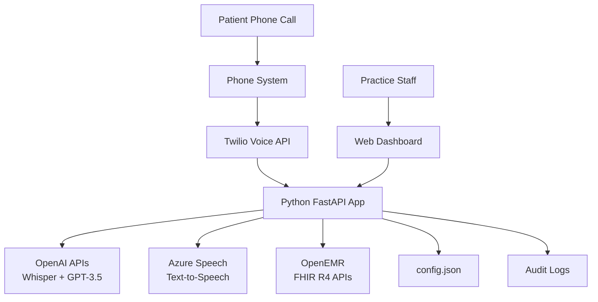

# **High Level Architecture**

## **Technical Summary**

The Voice AI Platform employs a **monolithic deployment architecture** with **modular internal components**, deployed as a single Windows executable for on-premise practice installation. The system integrates **FastAPI backend services** with a **vanilla JavaScript Bootstrap frontend**, connected to **OpenEMR via OAuth 2.0 and FHIR R4 APIs**.

Voice processing utilizes **cloud-based services**: speech-to-text (OpenAI Whisper), natural language processing (OpenAI GPT-3.5), and text-to-speech (Azure Speech Services), accepting higher operational costs for maximum simplicity and reliability.

## **Platform and Infrastructure Choice**

**Platform:** On-Premise Windows 10+ Deployment
**Key Services:** FastAPI web server, OpenAI/Azure APIs, OpenEMR OAuth client
**Deployment:** Practice local network, no cloud hosting required

## **Repository Structure**

```
voice-ai-platform/
├── src/
│   ├── main.py              # FastAPI application entry
│   ├── services/
│   │   ├── voice.py        # Voice processing service
│   │   ├── emr.py          # EMR integration service
│   │   ├── phone.py        # Phone system connector
│   │   ├── security.py     # Security and audit service
│   │   └── monitor.py      # System monitoring service
│   ├── config.py           # Configuration management
│   └── utils.py            # Helper functions
├── static/
│   ├── dashboard.html      # Admin dashboard
│   └── app.js              # Dashboard JavaScript
├── config.json             # Practice configuration
├── requirements.txt        # Python dependencies
├── install.bat            # Windows installer
└── README.md              # Setup documentation
```

## **High Level Architecture Diagram**


